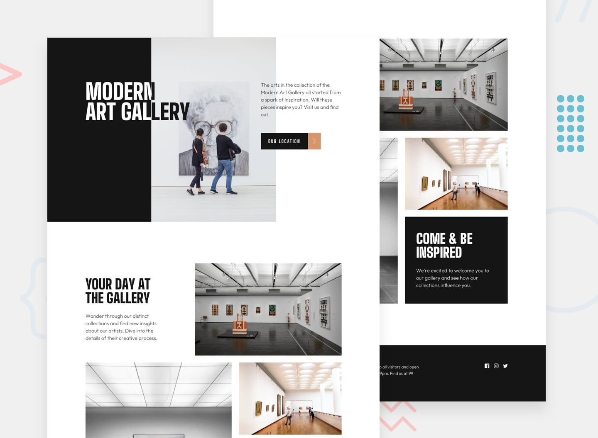

# Art gallery website



## Table of contents

- [Overview](#overview)
  - [The job](#the-job)
  - [Links](#links)
- [My process](#my-process)
  - [Built with](#built-with)
  - [AI collaboration](#ai-collaboration)
  - [Figma-to-implementation workflow for AI](#figma-to-implementation-workflow-for-ai)
  - [Useful resources](#useful-resources)
- [Author](#author)

## Overview

### The job

Users should be able to:

- View the optimal layout for each page depending on their device's screen size
- See hover states for all interactive elements throughout the site
- Use [Leaflet JS](https://leafletjs.com/) to create an interactive location map with custom location pin

### Links

- Repository: [https://github.com/ferfalcon/art-gallery-website](https://github.com/ferfalcon/art-gallery-website)
- Live Site: [https://art-gallery-website-ferfalcon.vercel.app](https://art-gallery-website-ferfalcon.vercel.app/)

## My process

### Built with

- Semantic HTML5 markup
- CSS custom properties
- Flexbox
- CSS Grid
- Mobile-first workflow
- [Astro](https://astro.build/) - web framework
- [TypeScript](https://www.typescriptlang.org/) - typed JavaScript
- [Leaflet](https://leafletjs.com/) - an open-source JavaScript library
for mobile-friendly interactive maps

### AI collaboration

- ChatGPT
  - Inspect and analyze Figma files
  - Project code implementation

### Figma-to-implementation workflow for AI

[https://github.com/ferfalcon/figma-to-implementation-workflow](https://github.com/ferfalcon/figma-to-implementation-workflow)

### Useful resources

- [Google | Build with Modern Web Guidance](https://developer.chrome.com/docs/modern-web-guidance) — modern web-platform guidance for coding agents

```bash
pnpm dlx skills add GoogleChrome/modern-web-guidance
```

## Author

- Website — [ferfalcon.com](http://ferfalcon.com/)
- LinkedIn — [Fernando Falcon](https://www.linkedin.com/in/fernandofalcon/)
